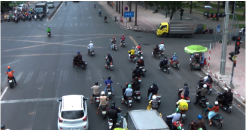
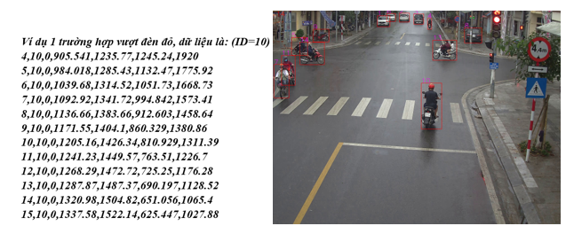
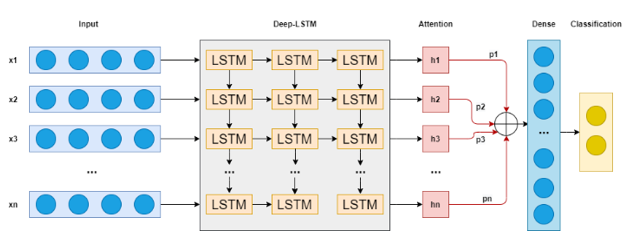
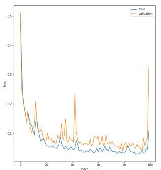
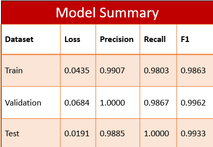

# VN Traffic Signal Violation Detection

## INTRODUCTION ##
- This is my project in VDT 2021, which is organized by Viettel. 
- Identify traffic violations of vehicles through video

## DATASET ##
- 1618 object in HaNam, VungTau, ThaiNguyen
- 1 object has len_sequence = 147, 1 sequence have 4 features
- 697 object label 0, 921 object label 1

## TOOLS AND FRAMEWORK USED ##
- Labelme
- Scikit-learn
- Keras
## MODEL: LSTM + ATTENTION ##

## RESULT ##
- Loss:

- Model Summary:

## NEED IMPROVEMENT ##
- Collect more data
- Handling unresolved cases
- Experiment with new model: Transformer,...
